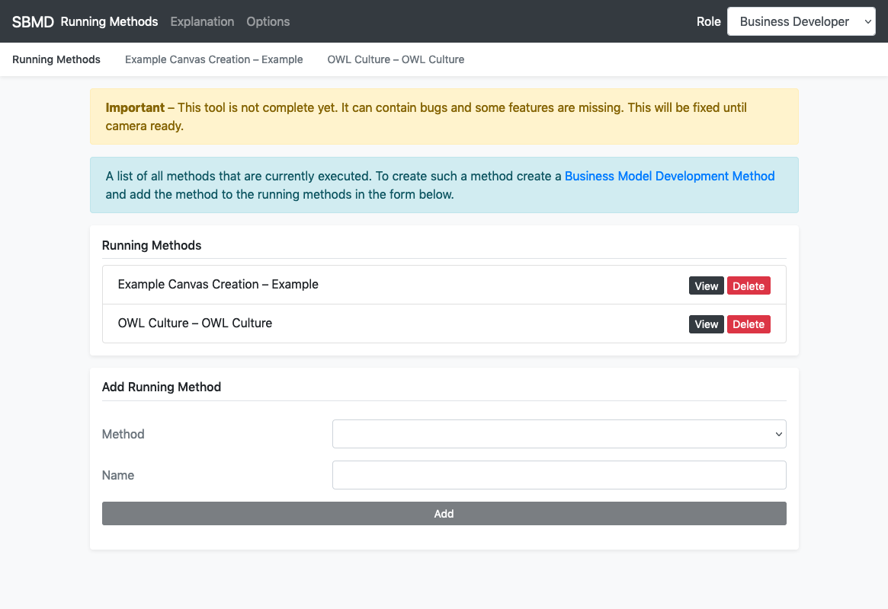
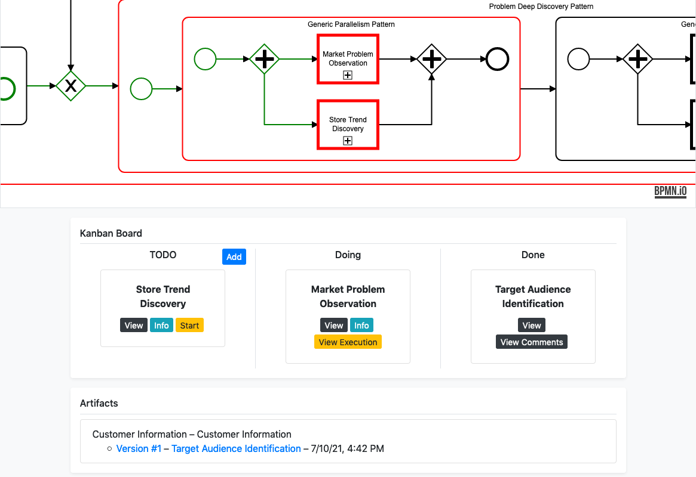
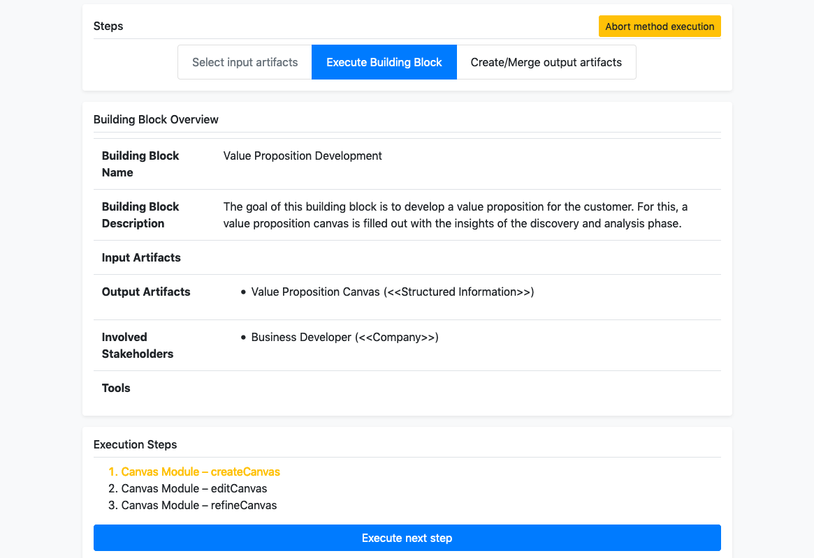

# Situational Business Model Developer

The Situational Business Model Developer allows the development of business models by taking the context of the company
and the product/service into account.

**Important**: This tool is not yet complete. It can contain bugs and some features are missing. This will be fixed
until camera ready.

## Introduction

The Situational Business Model Developer that allows the enaction of situation-specific Business Model Development
Methods. It uses the Method Modeler together with the Feature Modeler to support the business modeler in the enaction.
The business modeler is guided through the method in a kanban board and also sees the enacted method.

Additionally, the Situational Business Model Developer redirects the business developer to the correct locations in the
Feature Modeler to support the creation of different canvases, e.g., business model canvas and value proposition canvas.
The tools is based on the [Angular framework](https://angular.io/), the [PouchDB database](https://pouchdb.com/)
and [bpmn-js](https://bpmn.io/toolkit/bpmn-js/) to run directly in the webbrowser.

## Screenshots

| Create Running Method | Kanban board to enact method |
| ------ | ------ |
|  |  |

| Execute Building Block |
| ------ |
|  |

## Installation

1. Install [NodeJS](https://nodejs.org) and [AngularCLI](https://cli.angular.io/)
2. Clone Situational Business Model Developer repository to your computer
3. Install all NPM packages with `npm install`
4. Configure database 4.1. Internal database: By default the feature modeler is using PouchDB zu store data directly in
   the web storage of the browser. The database can be changed in `src/app/pouchdb.service.ts` within the
   variable `databaseName` (default: `bmdl-feature-modeler`)
   4.2. External database: The feature modeler allows also to use a CouchDB database as a persistent storage. For this,
   you need to change the `databaseName` in `src/app/pouchdb.service.ts` to `http://localhost:4200/database` and specify
   the url to the CouchDB in `proxy.conf.json` within the variable `target` (
   default: `http://localhost:5984/bmdl-modeler`)
5. Start service 5.1. Internal database: Run the web application with `ng serve`
   5.2. External database: Run the web application with `npm start` to use the proxy for the external database
6. Have fun with the tool :)

## Further Information

- **Live Demonstration:** http://sebastiangtts.github.io/situational-business-model-developer/
- **Research Paper:** Currently under review

## License

The Situational Business Model Developer is released under the MIT license.
