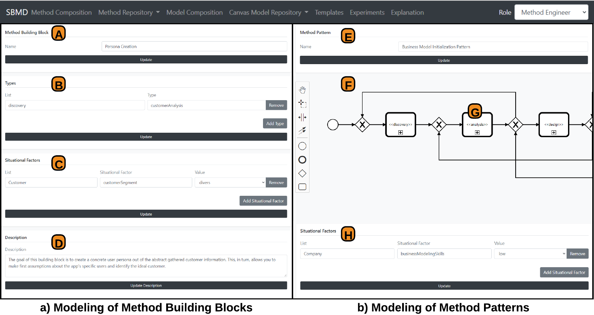
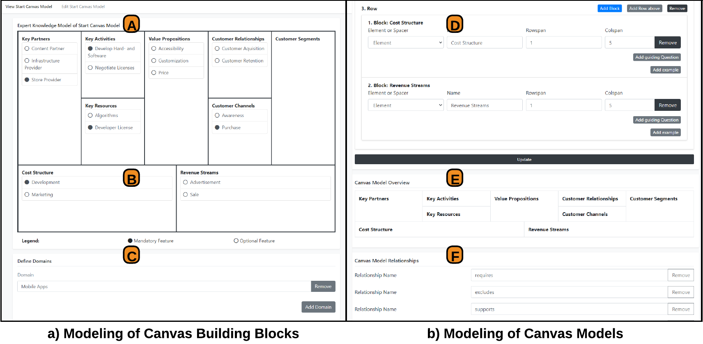
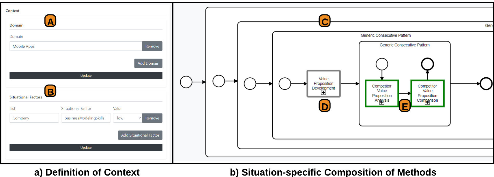
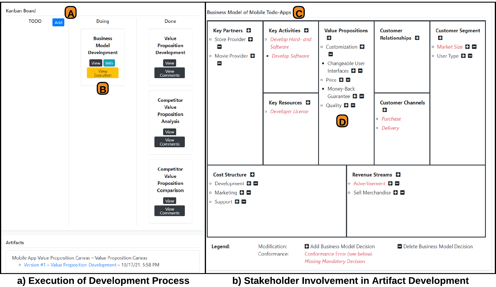
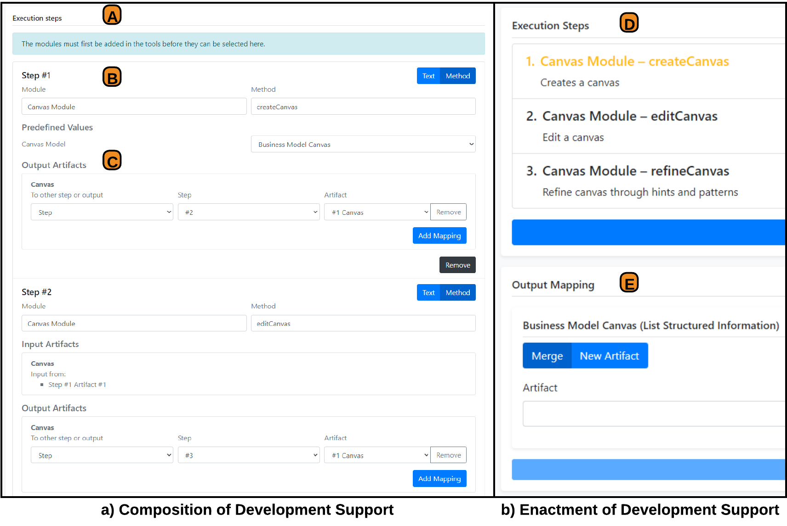

# Stages for Situations-specific Business Model Development
We provide the Situational Business Model Developer as the situated implementation of our approach. In the following, we present parts of our implementation according to the stages of knowledge provision of methods and models, composition and enactment of development methods, and support of development steps. The detailed explanation of our approach is described in our research papers.

## Stage 1: Knoweldge Provision of Method and Models
In the first stage, we provide CRUD operations for the knowledge inside the method repository and the canvas model repository. Inside the method repository, as shown in the next Figure, method elements are combined into method building blocks and, optionally, structured according to method patterns. Here, as shown in Figure (a), we have the modeling of a method building block. For that, we define the name of the building blocks (A) together with a description (D). Moreover, we are able to add different types or type lists (B) together with nominal or ordinal situational factors (C). As shown in Figure 1 (b), we have the modeling of the method patterns. For that, we define the name of the pattern (E) and the corresponding situational factors (H). Next to that, we construct a BPMN pattern (F), where each activity is linked to the supported types (G).

|  | 
|:--:| 
| *Figure 1: Screenshots for Provision of the Method Repository* |

Inside the canvas model repository, as shown in Figure 2, canvas elements are structured through canvas building blocks and visualized through canvas models. Here, as shown in Figure 2 (a), we have the modeling of the canvas building blocks. For that, each building block is directly mapped to a canvas model (A) where different items can be placed (B). Moreover, the application domains for the building block are defined (C). As shown in Figure 2 (b), we have the modeling of the canvas models. Here, we define the visualization of the model based on the definition of rows and columns (D). Moreover, we provide a preview of the visualization (E) together with definitions of different supported relationships (F).

|  | 
|:--:| 
| *Figure 2: Screenshots for Provision of the Canvas Model Repository* |

## Stage 2: Composition and Enactment of Development Methods
In the second stage, we construct and execute the development method out of the method repository and the canvas model repository. For the development method composition, as shown in Figure 3, we compose the methods and models based on the defined context. Here, as shown in Figure 3 (a), we define the context by selecting application domains (A) and situational factors (B) from the repositories. Moreover, we show the pattern-based composition of methods in Figure 3 (b). Here, the method is constructed from different nested patterns (C). Moreover, the activities are filled with method building blocks that are complete (E) or incomplete (D).
|  |  
|:--:| 
| *Figure 3: Composition of Development Methods* |

For the development method enactment, as shown in Figure 4, we enact the composed development method. Here, as shown in Figure 4 (a), we provide an execution of the development process. For that, we provide a Kanban board (A), where the different development steps can be placed on (B). Moreover, in Figure 4 (b), we have the collaboration of the stakeholders in the artifact development. Here, we provide a canvas board (C), where the different items can be placed on (D).

|  | 
|:--:| 
| *Figure 4: Enactment of Development Methods* |

## Stage 3: Support of Development Steps
In the third stage, we add flexible IT support to certain development steps. Here, as shown in Figure 5, we have the modularization of development support. In Figure 5 (a), we have the composition of modules, where we add different execution steps to a method building block (A). Those steps are combined so that they are executed in a row (B) and the outputs of a single step can be used as input in another one (C). In Figure 5 (b), the enactment of the modules is shown, where the steps are executed after each other (D). Moreover, the output of the execution steps can be stored in a new artifact or merged with an existing one (E).

|  | 
|:--:| 
| *Figure 3: Modularization of Development Support* |
